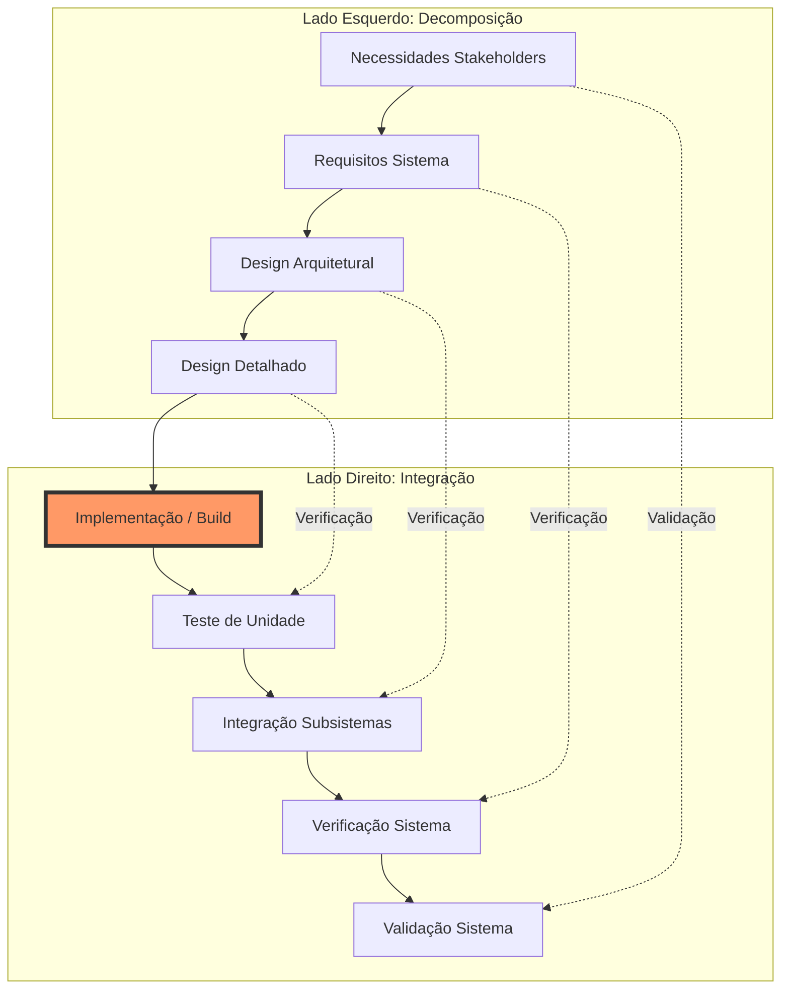

# V-Model (Vee Model)

O **Modelo em V** é a representação gráfica mais icônica do ciclo de vida da Engenharia de Sistemas (especialmente segundo o INCOSE). Ele ilustra a relação entre as fases de definição do sistema e as fases de integração e teste.

## 📐 Estrutura do "V"

### Lado Esquerdo: Decomposição e Definição (Top-Down)
1.  **Necessidades dos Stakeholders**: Definição do problema e contexto operacional.
2.  **Requisitos do Sistema**: Tradução das necessidades em especificações técnicas.
3.  **Design Arquitetural**: Estrutura de alto nível e subsistemas.
4.  **Design Detalhado**: Especificação de componentes, interfaces e lógica.

### A Base: Implementação
O ponto mais baixo do V, onde o sistema é construído (código escrito, hardware fabricado).

### Lado Direito: Integração e Verificação (Bottom-Up)
1.  **Teste de Unidade**: Verificação contra o design detalhado.
2.  **Integração de Subsistemas**: Verificação contra a arquitetura.
3.  **Verificação do Sistema**: Teste contra os requisitos do sistema (**Build the system right?**).
4.  **Validação do Sistema**: Teste no ambiente operacional contra as necessidades dos stakeholders (**Build the right system?**).

## 📊 Visualização Mermaid

## 🔗 Conexões
- [[Ciclo de Vida de Engenharia de Sistemas]]
- [[MBSE]]
- [[Rastreabilidade de Requisitos]]

## Fontes
- INCOSE Systems Engineering Handbook.
