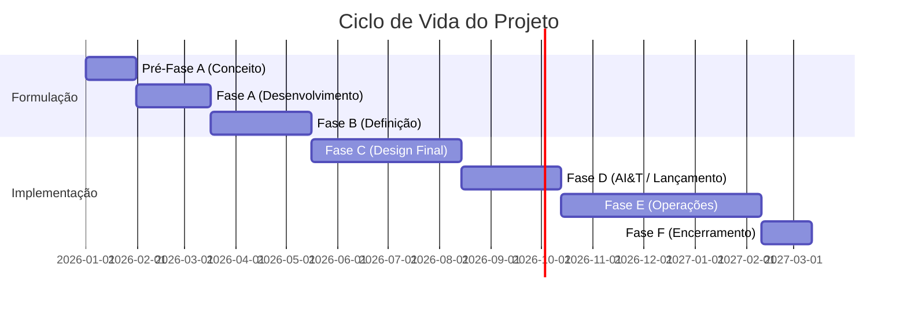

# 🗺️ Cheat Sheet: Ciclo de Vida SE Completo

Resumo visual das fases NASA/INCOSE para consulta rápida durante estudos.

## 🚀 Linha do Tempo de Fases (NASA)

## 📐 O V-Model Simplificado
- **Esquerda (Decomposição)**: O que queremos? → Como faremos?
- **Base (Construção)**: Fazer o produto.
- **Direita (Integração)**: Funciona? (Verificação) → Resolve o problema? (Validação)

## ⚖️ Critérios de Trade-off
Sempre que houver duas soluções, compare:
1. **Performance** (Atende o requisito?)
2. **Custo** (Cabe no orçamento?)
3. **Risco** (Conseguimos fazer a tempo?)
4. **Massa/Energia** (Restrições físicas)

## 🔗 Links Úteis
- [[V-Model (Vee Model)]]
- [[Análise de Trade-off (Trade Study)]]
- [[Fases de Implementação e Encerramento (C-F)]]
